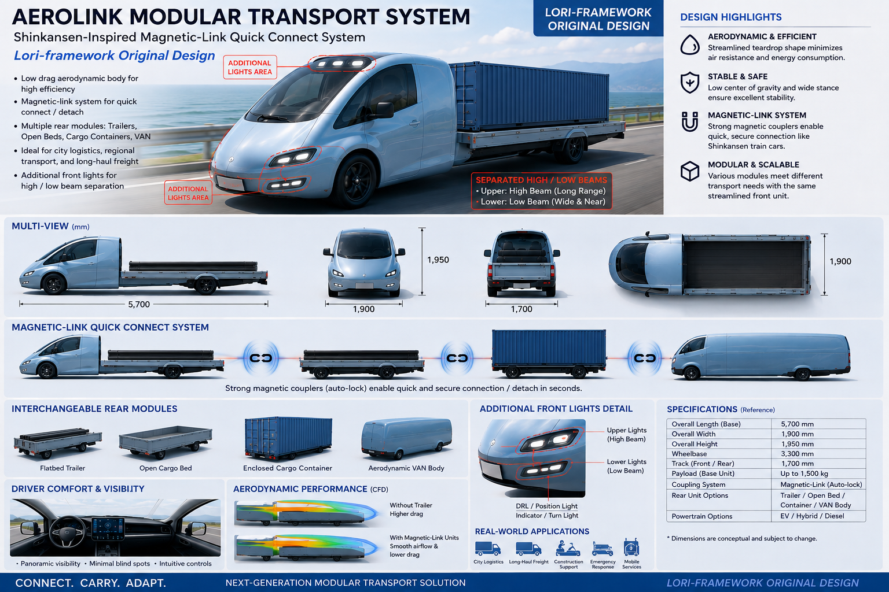
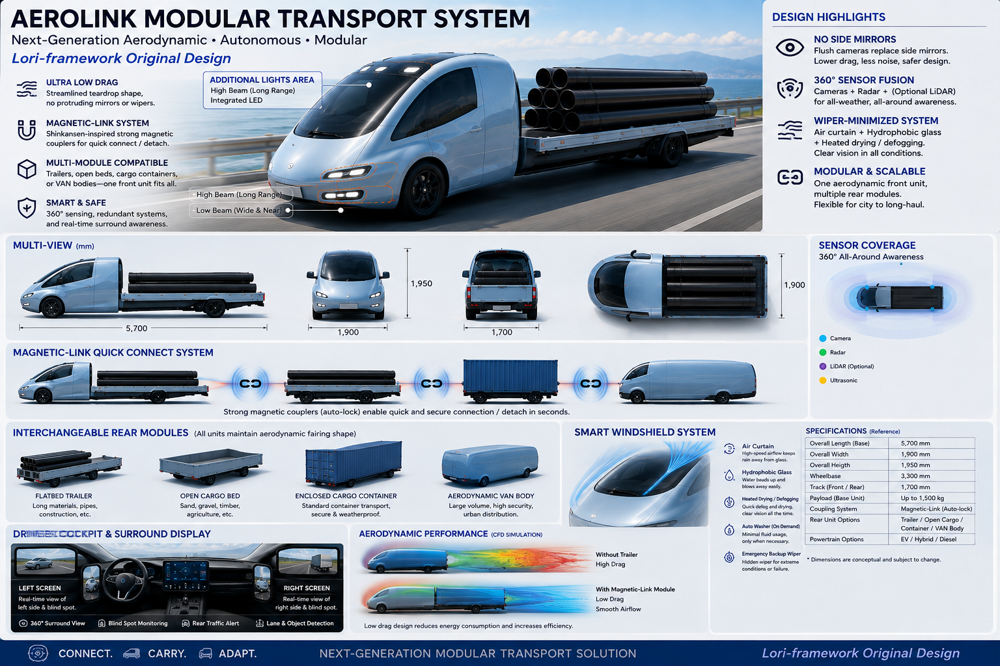
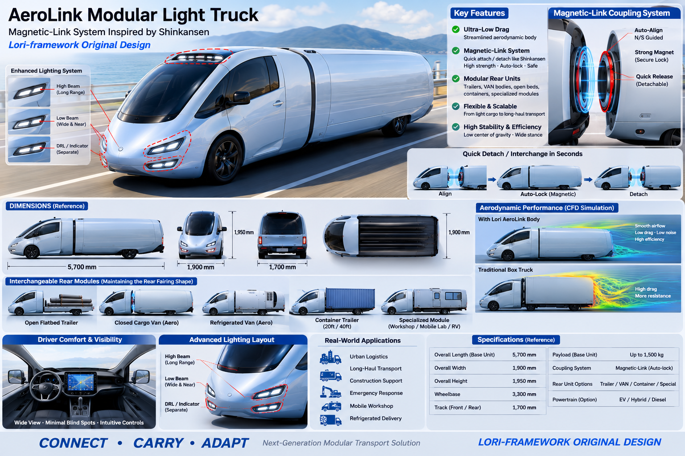

# LORI AeroLink Modular Transport

**Lori-framework Original Concept**
**Public Concept Timestamp: August 20, 2026**

> One streamlined vehicle platform. Multiple transport configurations.



## Overview

**LORI AeroLink Modular Transport** is a research-stage transportation concept exploring whether a highly aerodynamic front vehicle platform can be combined with interchangeable rear modules through a detachable coupling architecture.

The concept was inspired by the smooth, integrated form of high-speed rail systems such as the Shinkansen, but applies the design philosophy to modular road transport.

Instead of designing a separate vehicle for every transport purpose, AeroLink explores a common streamlined front platform that can connect to different rear modules depending on operational needs.

Possible configurations include:

* VAN module
* Enclosed cargo module
* Open cargo bed
* Flatbed / long-object carrier
* Specialized transport module

The project also explores removing traditional exterior components that interrupt airflow, including conventional side mirrors and exposed windshield wipers.

---

## Core Concept

### 1. Mirrorless 360° Sensor Fusion

Traditional side mirrors create external protrusions and aerodynamic drag.

AeroLink explores replacing them with integrated sensing systems using combinations of:

* Cameras
* Millimeter-wave radar
* Optional LiDAR
* Ultrasonic sensors
* AI-assisted object detection

Side and rear traffic information could be displayed on interior driver screens while simultaneously feeding the automated driving system.

The objective is not simply to remove mirrors, but to create a redundant **360° Sensor Fusion Vision System**.

---

### 2. Smart Windshield System

The concept also investigates reducing dependence on conventional exposed windshield wipers.

Possible technologies include:

**Hydrophobic Glass + Air Curtain + Washer Cleaning + Heated Defogging / Drying**

An aerodynamic air curtain could help move rainwater away from the windshield surface.

Hydrophobic coatings could reduce water adhesion, while integrated heating could assist with:

* Defogging
* Drying
* Ice prevention
* Visibility recovery

A production design may still require an emergency or redundant mechanical wiping system depending on safety requirements and applicable regulations.



---

### 3. Integrated High / Low Beam Lighting

Instead of concentrating all forward lighting into one conventional headlamp assembly, AeroLink explores separating lighting functions.

Possible architecture:

* **Upper lighting zone — long-range / high beam**
* **Lower lighting zone — near-field / low beam**

The lighting system can be integrated into the aerodynamic body surface to minimize unnecessary external protrusions.

---

### 4. Modular Rear Architecture

The rear section is designed as an interchangeable transport module rather than a permanently fixed body.

Conceptual modules may include:

* **VAN**
* **Open Cargo Bed**
* **Enclosed Cargo Container**
* **Flatbed**
* **Long-Object Carrier**
* **Special-Purpose Module**

This could allow one front vehicle platform to perform several transportation roles.

---

### 5. Magnetic-Assisted Detachable Coupling

AeroLink explores a **Shinkansen-inspired detachable coupling philosophy** for rapidly connecting and disconnecting rear modules.

The current concept investigates magnetic or electromagnetic assistance for:

* Alignment
* Positioning
* Connection guidance
* Coupling confirmation
* Rapid module exchange

A production system would likely require redundant mechanical locking, structural load paths, electrical/data connections, and fail-safe mechanisms.

**Important:** The magnetic coupling architecture shown in the concept artwork is exploratory and has not yet been validated as a road-legal structural coupling system.



---

## Design Philosophy

AeroLink follows a simple principle:

> **If an exterior component does not need to protrude from the vehicle, investigate whether it can be integrated into the body instead.**

This includes:

* Side mirrors
* Windshield wipers
* Sensors
* Lighting
* Door hardware
* Coupling interfaces

The objective is to combine:

**Aerodynamics + Modularity + Automation + Sensor Fusion**

into a unified transport architecture.

---

## Concept Architecture

```text
                 LORI AeroLink

        ┌─────────────────────────┐
        │  Aerodynamic Front Unit │
        │                         │
        │ Camera / Radar / LiDAR  │
        │ Smart Windshield        │
        │ Integrated Lighting     │
        └────────────┬────────────┘
                     │
             Detachable Interface
                     │
          Magnetic-Assisted Alignment
                     +
          Redundant Mechanical Lock
                     │
       ┌─────────────┼─────────────┐
       │             │             │
      VAN         Cargo Bed     Container
       │             │             │
       └────── Other Modules ──────┘
```

---

## Research Questions

This repository does **not** assume that every proposed component is technically or economically feasible.

Key questions requiring further investigation include:

1. Can a modular coupling system safely withstand longitudinal, lateral, torsional, braking, and crash loads?

2. What role, if any, should permanent magnets or electromagnets play in the coupling mechanism?

3. Would mechanical locking remain necessary for structural safety?

4. How much aerodynamic improvement could realistically result from removing conventional mirrors and exposed components?

5. Can an air-curtain windshield system remain effective during heavy rain, snow, mud contamination, insects, and freezing conditions?

6. How should sensor redundancy operate when cameras become obstructed?

7. How should electrical power, braking signals, vehicle data, and module identification pass through the detachable interface?

8. What regulatory requirements would apply to mirrorless operation, windshield clearing, lighting, automated driving, and modular vehicle coupling?

---

## Development Status

**Stage: Early Concept / Research Hypothesis**

This repository documents the evolution of the idea.

Concept illustrations should not be interpreted as finalized engineering drawings.

Dimensions, aerodynamic performance, structural specifications, magnetic forces, energy consumption, sensor configuration, and safety performance require independent engineering analysis and physical validation.

---

## Version History

### v0.1 — August 20, 2026

Initial public concept documentation.

Introduced:

* Aerodynamic modular front vehicle
* Interchangeable rear transport modules
* Magnetic-assisted detachable coupling concept
* Mirrorless 360° sensor fusion
* Smart windshield / wiper-minimized concept
* Integrated separated high / low beam lighting

Future revisions should be added as new versions rather than deleting the original concept history.

---

## Concept Attribution

**Concept Originator:** Lori
**Framework:** Lori-framework
**Concept:** LORI AeroLink Modular Transport
**Initial Public Documentation:** August 20, 2026

The purpose of this repository is to maintain a transparent, timestamped record of the concept and its subsequent technical development.

---

## Prior Art & Originality Notice

This project is presented as an independently developed research-stage concept.

Individual technologies discussed here — including digital mirrors, sensor fusion, aerodynamic vehicle bodies, modular cargo systems, magnetic technologies, hydrophobic surfaces, windshield heating, and automated driving systems — may already exist independently or in related combinations.

No claim is made at this stage that every individual component or combination is novel, patentable, or unprecedented.

Prior-art research and technical comparison should therefore remain an ongoing part of this project.

---

## Safety Notice

This repository describes a conceptual transportation architecture.

It is **not** a certified vehicle design, construction specification, or recommendation for modification of road vehicles.

Any physical prototype would require professional structural engineering, vehicle dynamics analysis, braking-system design, electrical safety engineering, crash analysis, regulatory review, and controlled testing before public-road operation.

---

## Guiding Idea

> **CONNECT. CARRY. ADAPT.**

Design the vehicle around the mission — instead of building a completely different vehicle for every mission.

---

**Lori-framework Original Concept — 2026**
